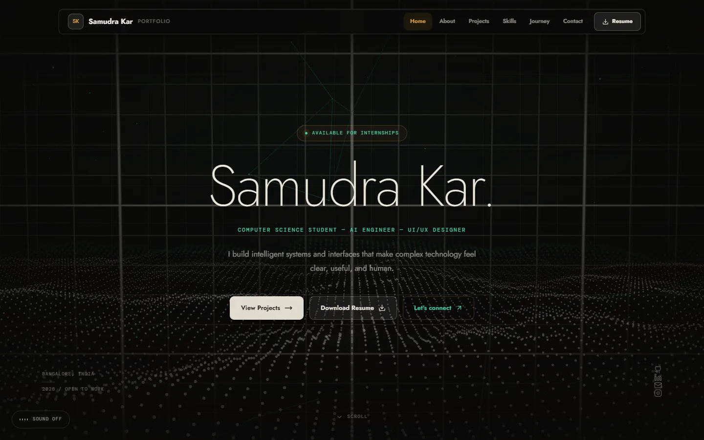
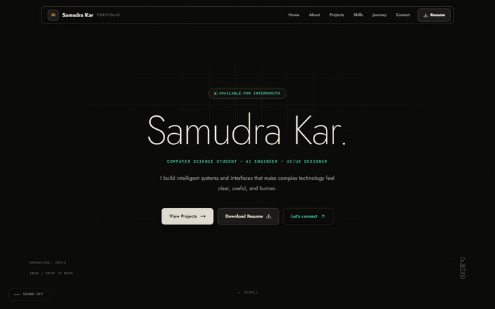
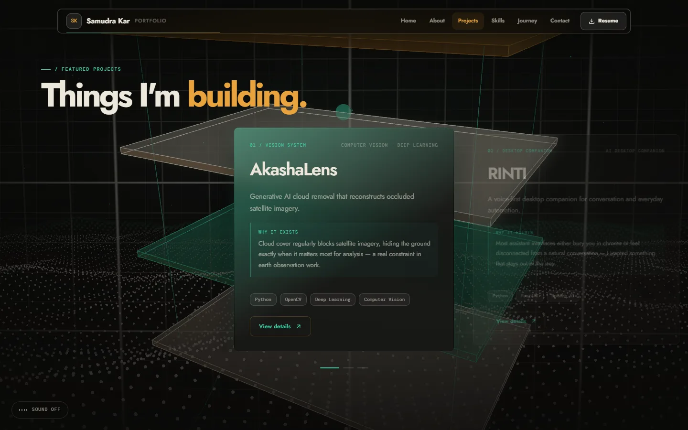
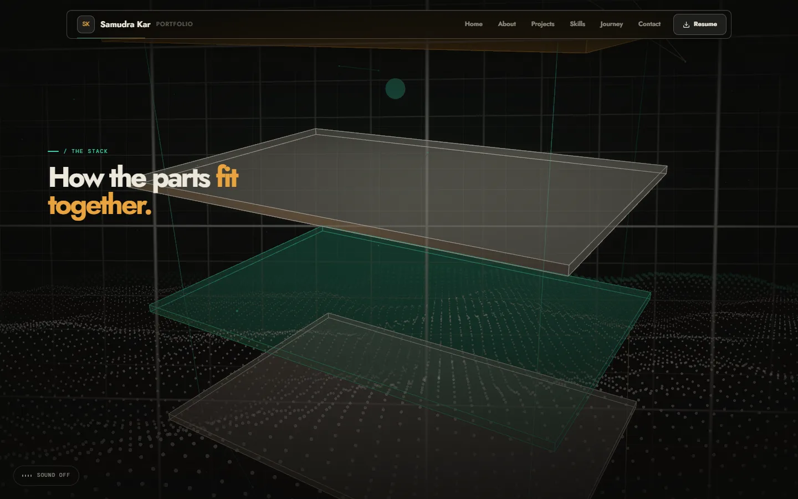
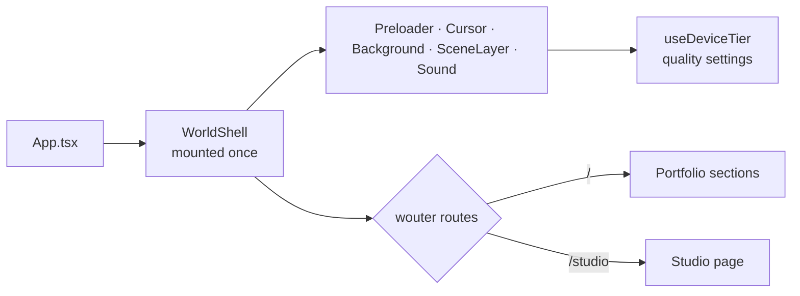

<div align="center">



<br />

     

<br />

**[Run it](#run-it)** &nbsp;·&nbsp; **[Features](#features)** &nbsp;·&nbsp; **[Architecture](#architecture)** &nbsp;·&nbsp; **[Installation](#installation)** &nbsp;·&nbsp; **[Limitations](#limitations)**

</div>

---

<p align="center">
  
</p>

This is the portfolio of Samudra Kar, a computer science student working on AI, UI/UX design and frontend. It is built to show range rather than to fill a template with project cards: one persistent WebGL scene sits behind the whole site, and the sections are laid out as a narrative, from hero to about, journey, manifesto, skills, systems, projects and contact.

The environment (instrument grid, point field, cursor, sound) lives in a shell that never unmounts, so moving between pages doesn't tear the scene down and rebuild it. Sound is synthesised at runtime and muted by default.

## Run it

```bash
git clone https://github.com/Samudra-GITHub/samudra-kar-portfolio.git
cd samudra-kar-portfolio && npm install && npm run dev
```

Then open <http://localhost:5173>. The contact form needs EmailJS keys (see [Environment](#environment)); everything else works without them.

## Features

<table>
  <tr>
    <td width="50%" valign="top">
      
      <h3>Projects as a stack of cards</h3>
      <p>Featured projects sit on layered planes in the 3D scene. Details open in a modal, so the scroll is never interrupted by a page load.</p>
    </td>
    <td width="50%" valign="top">
      
      <h3>A persistent 3D layer</h3>
      <p>React Three Fiber, Drei and postprocessing, with custom shaders (point field, scan grid), a node network and a reconstruction field. The scene responds to scroll.</p>
    </td>
  </tr>
  <tr>
    <td width="50%" valign="top">
      
      <h3>Adaptive quality</h3>
      <p>A device-tier hook (<code>low</code>, <code>medium</code>, <code>high</code>) scales particle counts and drops expensive post-processing on weaker devices.</p>
    </td>
    <td width="50%" valign="top">
      <h3>Procedural sound</h3>
      <p>Every sound is synthesised with the Web Audio API, with no audio files. It is muted by default and only the toggle starts it.</p>
      <h3>Motion with manners</h3>
      <p>Framer Motion for transitions, Lenis for smooth scrolling, a custom cursor and magnetic buttons, with reduced-motion support.</p>
    </td>
  </tr>
</table>

**Also:** a Studio page at `/studio`; a contact form that sends from the browser through EmailJS; a downloadable resume (`public/resume.pdf`).

## Tech stack

| Layer | Technology |
| :-- | :-- |
| Framework | React 19, TypeScript, Vite 7, `wouter` routing |
| Styling | Tailwind CSS 4, `tw-animate-css` |
| 3D | Three.js, React Three Fiber, Drei, `@react-three/postprocessing` |
| Motion | Framer Motion, Lenis |
| Email | EmailJS (client-side) |

## Architecture



`App.tsx` wraps all routes in a `WorldShell` that mounts the preloader, cursor, background, `SceneLayer` and sound once, so page content swaps inside a stable environment. Project and copy content lives in `src/lib/data.ts`. The 3D layer reads the device tier from `useDeviceTier` to pick density and effects.

```text
samudra-kar-portfolio/
├── index.html
├── public/         resume.pdf, forest-background.jpg
├── src/
│   ├── App.tsx     World shell and routes (/ and /studio)
│   ├── pages/      Portfolio, Studio
│   ├── sections/   Hero ... Contact, ProjectModal, studio/
│   ├── three/      SceneLayer, AetherScene, environment/, scenes/, shaders/
│   ├── components/ Navigation, Preloader, CustomCursor, SoundToggle, ...
│   ├── hooks/      device tier, reduced motion, section progress, ...
│   └── lib/        data.ts (content), audio.ts (procedural audio)
├── docs/screenshots/
└── vite.config.ts  "@" alias to src/, dev server on :5173
```

## Installation

Requires Node.js and npm.

```bash
npm install
```

| Command | What it does |
| :-- | :-- |
| `npm run dev` | Start Vite on port 5173 |
| `npm run build` | Production build |
| `npm run preview` | Preview the build |
| `npm run typecheck` | Type-check with `tsc --noEmit` |

### Environment

Copy `.env.example` to `.env` to enable the contact form.

| Variable | Purpose |
| :-- | :-- |
| `VITE_EMAILJS_SERVICE_ID` | EmailJS service |
| `VITE_EMAILJS_TEMPLATE_ID` | EmailJS template |
| `VITE_EMAILJS_PUBLIC_KEY` | EmailJS public key |

These are bundled into the client build, so use only EmailJS's public key.

### Deploy

No deployment configuration is included. It is a static Vite build (`npm run build`), and no public deployment is currently listed.

## Limitations

- The mobile layout has a known overlap in the hero: the social icons collide with the location text.
- No dedicated photography section yet, and the Studio page is brief.

## License

[MIT](LICENSE).
